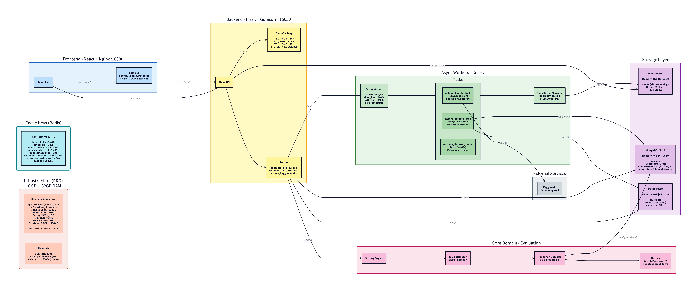

# Data Labelling App (DLA)



Reference implementation of the **Data Labelling App**: a pedagogical platform for image **classification**, **object detection**, and **segmentation** that integrates data literacy, supervisor-validated annotation practice, and asynchronous export to COCO and/or YOLO.

Companion manuscript: *Image Annotation Tool for Dataset Generation and Export with Specialist Training* ([`docs/article.tex`](docs/article.tex), BRACIS 2026).

---

## Overview

DLA couples classroom annotation practice with dataset generation. A **supervisor** (teacher) registers datasets and exercises; **annotators** (students) submit labels under:

- **Assisted practice** — responses compared to a supervisor reference; automatic geometric grading.
- **Free practice** — labeling without immediate scoring in the same flow.

Validated submissions can be exported as training-ready ZIP archives. The geometric grader (IoU, Hungarian matching, precision/recall/F1) is formalized in the paper; implementation details below supplement the shortened architecture section in the manuscript.

> **Roles:** *supervisor* ≈ teacher · *annotator* ≈ student (same individuals, platform vs. classroom vocabulary).

---

## Monorepo layout

| Path | Role |
|------|------|
| [`src/`](src/), [`app.py`](app.py) | Flask API, evaluation domain, Celery workers |
| [`frontend/`](frontend/) | React web client (annotation UI, dashboard, export) — see [`frontend/README.md`](frontend/README.md) |
| [`docker-compose.yml`](docker-compose.yml) | Full stack: API, frontend, MongoDB, Redis, optional MinIO / observability |

Public repository: [github.com/ramos-ai/dla-bracis](https://github.com/ramos-ai/dla-bracis).

---

## System architecture

### Workflow

1. Supervisor creates datasets and exercises (classification, detection, or segmentation).
2. Annotator submits per-image responses (`labelledAnswers` for graded practice; `unlabelledAnswers` for free practice).
3. Server persists submissions and computes supervised scores when configured.
4. Supervisor dashboard aggregates completion, scores, and alerts.
5. Long-running exports are delegated to Celery workers; output is polled by task id.

### Reference stack

| Layer | Technology |
|-------|------------|
| Web client | React, Vite, Nginx ([`frontend/`](frontend/)) |
| API | Flask, Gunicorn, JWT |
| Persistence | MongoDB, GridFS or S3/MinIO |
| Tasks | Redis, Celery |
| Observability | Prometheus, Grafana (optional profile) |
| Evaluation | Pure Python (`src/domain/evaluation/`) |

### Code layout

Layered backend: HTTP routes → application use cases → domain logic → infrastructure.

```
src/
├── presentation/      # Blueprints, DTOs, auth, exception mapping
├── application/     # Datasets, exercises, export, reports
├── domain/            # Evaluation (IoU, matching, metrics); exceptions
├── infrastructure/    # MongoDB, Celery, S3/GridFS, security, config
└── shared/            # Logging, utilities
```

### Evaluation module

| Component | Module | Role |
|-----------|--------|------|
| IoU (bbox + polygon) | `iou_calculator.py` | Shoelace area; Shapely mask IoU; effective IoU for segmentation |
| Matching | `matching_strategy.py` | Hungarian assignment; same-class pairs; cost `1 − IoU` |
| Metrics | `metrics.py` | Precision, recall, F1 from TP/FP/FN |
| Orchestration | `scoring_engine.py` | Classification, detection, segmentation entry points |

Constants (`ε`, `ε_seg`, `A_min`) are in `constants.py` and match the paper.

### Export pipeline

`ExportConfig` (`application/datasets/export_config.py`): train/val/test splits, format (`coco`, `yolo`, `both`, `auto`), seed, class filters, optional unlabeled inclusion, resize/JPEG quality. ZIP assembly runs in `infrastructure/celery/jobs/export.py`.

---

## Quick start

**Docker (recommended)**

```bash
cp .env.example .env    # set JWT_SECRET_KEY (required)
docker compose up -d
```

| Service | URL |
|---------|-----|
| API | http://localhost:15050 |
| Swagger | http://localhost:15050/api-docs |
| Frontend | http://localhost:18080 |

**Local API**

```bash
pip install -r requirements.txt
python app.py
```

**Local frontend** (requires running API on port 5000):

```bash
cd frontend && npm ci && npm run dev
```

**Observability:** `docker compose --profile observability up -d` (Prometheus `:19090`, Grafana `:13000`).

**Tests:** `pytest` from the repository root.

---

## Configuration

See [`.env.example`](.env.example). Required: `JWT_SECRET_KEY`, MongoDB connection. Set `S3_STORAGE_ENABLED=true` with MinIO/S3 credentials for object storage instead of GridFS-only mode.

Main API groups: `/api/auth`, `/api/dataset`, `/api/exercises`, `/api/export`, `/api/tasks`, `/api/health`.

---

## Authors

Pedro da Rosa · Augusto Reich · Felipe Zeiser · Gabriel Ramos  
Graduate Program in Applied Computing, Universidade do Vale do Rio dos Sinos (UNISINOS)

---

## Funding

Partial support from Conselho Nacional de Desenvolvimento Científico e Tecnológico (CNPq) — grants 313845/2023-9, 443184/2023-2, 445238/2024-0, and 404800/2025-4.

---

## Citing

If you use this software in academic work, please cite the companion BRACIS paper (BibTeX to be updated with proceedings metadata):

```bibtex
@inproceedings{darosa2026dla,
  author    = {da Rosa, Pedro and Reich, Augusto and Zeiser, Felipe and Ramos, Gabriel de O.},
  title     = {Image Annotation Tool for Dataset Generation and Export with Specialist Training},
  booktitle = {Brazilian Conference on Intelligent Systems (BRACIS)},
  year      = {2026},
  organization = {IEEE},
  note      = {Update venue pages and DOI when available}
}
```

---

## License

[MIT](LICENSE)
